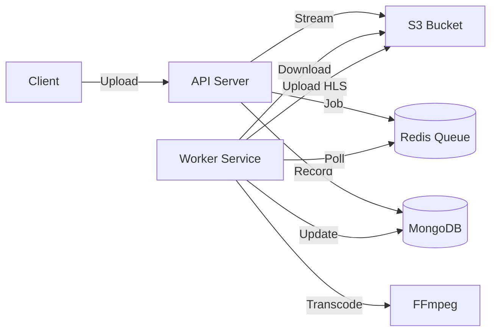

# Video Transcoder Service

A production-ready video transcoding service that uploads videos to S3/Wasabi and transcodes them into HLS format with multiple resolutions (360p, 480p, 720p, 1080p).

## 🚀 Features

- **Asynchronous Processing**: Uploads are decoupled from transcoding using a queue-based architecture.
- **Scalable**: Uses Redis + BullMQ for job queues and separate worker processes.
- **Streaming Uploads**: Streams files directly to S3 (no memory buffering issues).
- **HLS Streaming**: Generates adaptive bitrate HLS playlists (m3u8).
- **Optimized Playback**: Proxies HLS segments with streaming and caching headers for fast HD playback.
- **Resilient**: Automatic retries, stalled job handling, and robust error tracking.
- **Status API**: Real-time progress tracking of transcoding jobs.

## 🛠️ Architecture



## 📋 Prerequisites

- Node.js (v18+)
- MongoDB
- Redis
- FFmpeg installed on the system
- AWS S3 or Wasabi account

## ⚙️ Setup

1. **Install dependencies**
   ```bash
   npm install
   ```

2. **Configure Environment**
   Copy `.env.example` to `.env` and update the values:
   ```env
   # Storage
   AWS_ACCESS_KEY_ID=your_key
   AWS_SECRET_ACCESS_KEY=your_secret
   AWS_REGION=ap-southeast-1
   AWS_S3_BUCKET_NAME=your_bucket
   WASABI_ENDPOINT=s3.ap-southeast-1.wasabisys.com

   # Database & Queue
   MONGODB_URI=mongodb://localhost:27017/video-transcoder
   REDIS_HOST=localhost
   REDIS_PORT=6379

   # Worker
   WORKER_CONCURRENCY=2
   ```

3. **Start the Services**
   You need to run both the API server and the Worker process.

   **Terminal 1 (API Server):**
   ```bash
   npm run dev
   ```

   **Terminal 2 (Worker):**
   ```bash
   npm run worker:dev
   ```

## 🔌 API Endpoints

### 1. Upload Video
**POST** `/api/upload/v1/upload`
- Uploads a video file and queues it for processing.
- Returns `202 Accepted` immediately with a `jobId`.

### 2. Check Status
**GET** `/api/upload/v1/jobs/:jobId/status`
- specific job status (queued, processing, completed, failed).
- Returns progress percentage (0-100).

### 3. List Jobs
**GET** `/api/upload/v1/jobs`
- Lists recent jobs.

### 4. Retry Failed Job
**POST** `/api/upload/v1/jobs/:jobId/retry`
- Retries a failed job.

### 5. Playback
**GET** `/api/upload/stream/:videoId`
- Returns the HLS master playlist URL.

## 📂 Project Structure

- `src/index.js` - API Server entry point
- `src/services/transcodeWorker.js` - Background worker process
- `src/controllers/asyncUploadController.js` - Async upload logic
- `src/config/queue.js` - Redis & BullMQ configuration
- `src/models/Job.js` - MongoDB Job schema